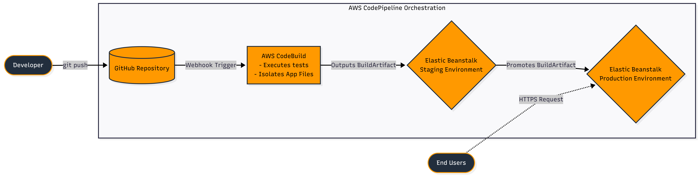

# Infrastructure Automation: End-to-End CI/CD Pipeline

## Objective

This project implements an automated CI/CD release pipeline for a Node.js web application using AWS infrastructure automation. The objective is to reduce manual deployment work, validate source changes before release, and deliver the same tested application artifact across staging and production environments with minimal operational bottlenecks.

## Services Used

| Service | Role in the Architecture |
| --- | --- |
| GitHub | Hosts the application source code and triggers the pipeline when changes are pushed to the main branch. |
| AWS CodeConnections | Provides the GitHub App connection used by CodePipeline to securely access the repository and receive source change events. |
| AWS CodePipeline | Orchestrates the full CI/CD workflow across source, build, staging deployment, approval, and production deployment stages. |
| AWS CodeBuild | Provisions a managed build container, runs grep-based validation tests, and packages the application into a deployable artifact. |
| AWS Elastic Beanstalk | Hosts the Node.js application in managed staging and production environments while abstracting EC2 provisioning, deployment, and health monitoring. |
| AWS IAM | Provides service roles and permissions for CodePipeline, CodeBuild, and Elastic Beanstalk to interact securely. |
| Amazon EC2 | Runs the underlying Elastic Beanstalk compute instances using a single-instance configuration. |
| Amazon S3 | Stores CodePipeline source and build artifacts between stages. |
| Amazon CloudWatch | Supports environment observability through Elastic Beanstalk health metrics and application logs. |

## Architecture Flow

<!-- Cntrl+click cicd.png -->

 

The workflow starts when code is committed and pushed to the GitHub repository. GitHub triggers AWS CodePipeline through the configured GitHub App connection and webhook, starting the source stage. This stage collects the repository contents and produces `SourceArtifact`, which becomes the input for the build stage.

AWS CodeBuild then launches a managed Ubuntu-based build container, reads the `buildspec.yml` file, runs grep-based validation checks, and packages only the required application files into `BuildArtifact`. The build artifact is immutable and becomes the single release package used by the downstream environments.

CodePipeline first deploys `BuildArtifact` to the Elastic Beanstalk staging environment for pre-production validation. After the staging deployment is reviewed and approved, the pipeline promotes the exact same artifact to the production Elastic Beanstalk environment. This ensures that the production release matches the artifact already tested in the earlier stage.

## Cost Analysis

This architecture is designed to remain within the AWS Free Tier:

- Elastic Beanstalk uses a single-instance environment, which can run on Free Tier eligible EC2 capacity when configured with an eligible instance type.
- CodeBuild usage can remain within the monthly Free Tier build minute allowance for small validation jobs.
- CodePipeline usage for a basic pipeline is low-cost and suitable for small project automation.
- S3 artifact storage remains minimal because only lightweight source and build artifacts are stored.
- GitHub is used as the third-party source control platform and can be operated with a free repository plan.

Costs may increase if larger EC2 instances, long-running environments, high build frequency, additional pipelines, or larger artifact storage are introduced.

## Key Engineering Decisions: The Why

### Artifact Isolation

The `buildspec.yml` artifacts block was explicitly configured to isolate only the deployable application files:

- `app.js`
- `index.html`
- `package.json`
- `cron.yaml`

This keeps the final deployment package lightweight and prevents build-specific configuration file `buildspec.yml` from being sent to Elastic Beanstalk.

### Managed Compute

Elastic Beanstalk was used to manage application hosting instead of manually provisioning and maintaining EC2 instances. This allows the deployment architecture to rely on managed environment provisioning, application deployment handling, health checks, and platform management while keeping the CI/CD pipeline focused on application delivery.

### Immutable Artifact Management

The pipeline follows a strict "Build Once, Deploy Many" strategy. CodeBuild creates one validated `BuildArtifact`, and both staging and production deployments consume that same artifact. This eliminates environment drift because production receives the exact codebase that was already built, tested, and deployed to staging.

### Controlled Production Promotion

The production deployment is protected by a manual approval gate after the staging deployment. This creates a safe review point before live release while still preserving automation for the final deployment once approval is granted.

## Outcome

The completed solution demonstrates a fully automated CI/CD pipeline that connects GitHub, AWS CodeBuild, AWS CodePipeline, and AWS Elastic Beanstalk. It removes repetitive manual deployment steps, validates code before release, separates staging from production, and promotes a single immutable artifact across environments for consistent and reliable delivery.
